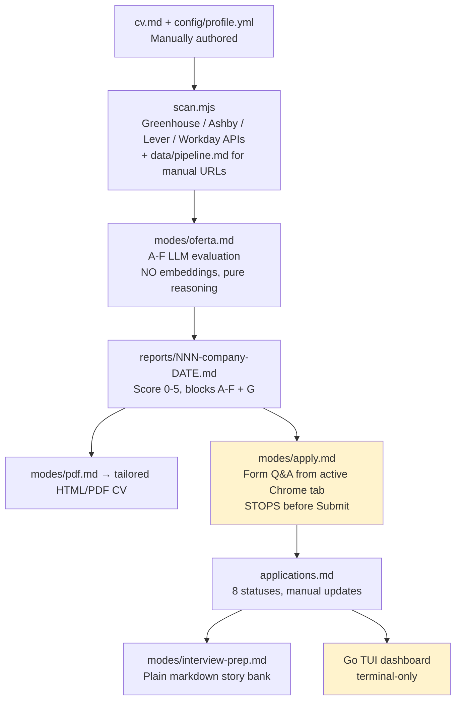
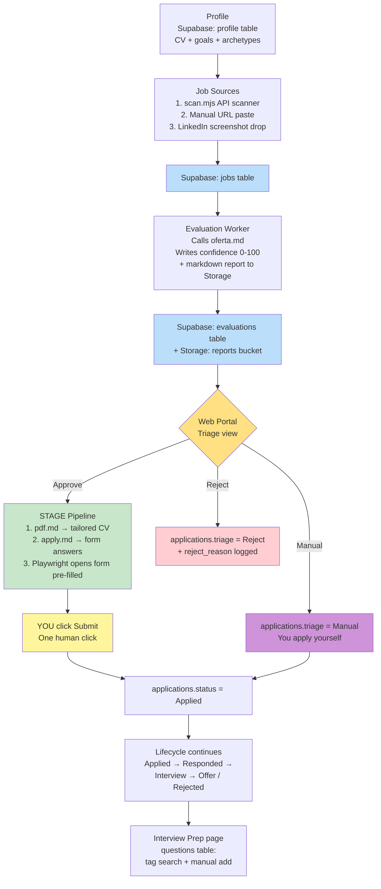

# Bijan — Job Application Portal Build Plan

> Live task tracker. Tick items off as we complete them. Delete this file when everything is done (task 8.5).

## Context

This repo started as a clone of [career-ops](https://github.com/santifer/career-ops) — a CLI-driven AI job-search system that already implements ~80% of the desired flow across CLI modes and a Go terminal UI. We are extending it into a personal **Bijan** job-application portal:

1. 3-bucket triage (Approve / Reject / Manual) on top of the existing 8-state lifecycle.
2. Cloud database via **Supabase** (Postgres + Auth + Storage), replacing markdown as the structured source of truth. Reports stay as markdown documents in Storage so the AI agents can still read them.
3. **Next.js + Tailwind + shadcn/ui** web portal, deployed to Vercel.
4. Stage + 1-click submit (Playwright opens form pre-filled, *user* clicks Submit).
5. Structured interview-prep question bank in Postgres (no embeddings / no RAG).
6. Whole repo pushed to **GitHub** (private), with user data + secrets gitignored.

---

## Flowchart 1 — As-Is



## Flowchart 2 — Proposed (To-Be)



---

## Architecture

```
GitHub repo (private)
└── Bijan/
    ├── modes/                  # career-ops AI prompts (unchanged, reused)
    ├── *.mjs                   # career-ops scripts (unchanged, reused)
    ├── dashboard/              # Go TUI (kept as backup view)
    ├── portal/                 # NEW — Next.js web app
    │   ├── app/                # App Router pages
    │   ├── components/         # shadcn/ui + custom
    │   ├── lib/supabase.ts     # Supabase client
    │   └── api/                # Route handlers that shell out to .mjs scripts
    ├── supabase/               # NEW
    │   ├── migrations/         # SQL migrations
    │   └── seed.sql            # initial profile seed
    └── stage-form.mjs          # NEW — Playwright pre-fill
```

**Hosting:** Portal on Vercel. Supabase managed. Both have free tiers.

---

## Supabase Schema

```sql
-- Singleton: your profile
create table profile (
  id uuid primary key default gen_random_uuid(),
  cv_md text not null,
  goals_md text,
  archetypes jsonb,
  updated_at timestamptz default now()
);

-- Job postings
create table jobs (
  id uuid primary key default gen_random_uuid(),
  source_type text check (source_type in ('api','manual_url','screenshot')),
  source_url text,
  company text,
  title text,
  raw_jd text,
  screenshot_path text,
  scanned_at timestamptz default now(),
  unique(source_url)
);

-- Evaluations
create table evaluations (
  id uuid primary key default gen_random_uuid(),
  job_id uuid references jobs(id) on delete cascade,
  confidence_score int check (confidence_score between 0 and 100),
  letter_grade text,
  block_a jsonb, block_b jsonb, block_c jsonb,
  block_d jsonb, block_e jsonb, block_f jsonb,
  report_md_path text,
  evaluated_at timestamptz default now()
);

-- Applications (triage + lifecycle)
create table applications (
  id uuid primary key default gen_random_uuid(),
  job_id uuid references jobs(id) on delete cascade unique,
  triage text check (triage in ('approve','reject','manual')),
  status text check (status in ('evaluated','applied','responded','interview','offer','rejected','discarded','skip')) default 'evaluated',
  reject_reason text,
  applied_at timestamptz,
  updated_at timestamptz default now()
);

-- Tailored CV versions
create table cv_versions (
  id uuid primary key default gen_random_uuid(),
  job_id uuid references jobs(id) on delete cascade,
  html text,
  pdf_path text,
  generated_at timestamptz default now()
);

-- Form Q&A
create table form_answers (
  id uuid primary key default gen_random_uuid(),
  job_id uuid references jobs(id) on delete cascade,
  question text not null,
  answer text not null,
  source text check (source in ('report','manual','edited'))
);

-- Interview question bank
create table interview_questions (
  id uuid primary key default gen_random_uuid(),
  question text not null,
  answer text not null,
  tags text[],
  source_job_id uuid references jobs(id) on delete set null,
  created_at timestamptz default now()
);

create index on applications(triage);
create index on applications(status);
create index on evaluations(confidence_score desc);
create index on interview_questions using gin(tags);
```

**Storage buckets:** `cvs`, `screenshots`, `reports` (all private).

---

## Detailed Task List

### Phase 0 — Repo & GitHub setup ✅
- [x] **0.0** Copy plan to `Bijan/Bijan/plan.md` (this file)
- [x] **0.1** Init git
- [x] **0.2** Update `.gitignore`: added `.env.local`, `interview-prep/`, `portal/.next/`, `portal/node_modules/`, `*.pdf`
- [x] **0.3** Extended `.env.example` with Supabase + Anthropic keys
- [x] **0.4** First commit: `chore: import career-ops base + Bijan plan` (188 files, sensitive paths verified excluded)
- [x] **0.5** Pushed to https://github.com/AI-Tutor1/Bijan (private)
- [ ] **0.6** Portal README — deferred to Phase 6 once `portal/` exists

### Phase 1 — Supabase project ✅
- [x] **1.1** Project created at supabase.com (ref: `fmrcvqhfzbfcueuowdzo`)
- [x] **1.2** Keys saved to `Bijan/.env.local` (gitignored)
- [x] **1.3** Created folder `Bijan/supabase/migrations/`
- [x] **1.4** Wrote migration `0001_initial_schema.sql`
- [x] **1.5** Migration applied (verified by `scripts/setup-supabase.mjs`)
- [x] **1.6** Buckets `cvs`, `screenshots`, `reports` created (private)
- [x] **1.7** Profile row seeded with `examples/cv-example.md` (will be replaced via portal Profile page in Phase 6.9)
- [x] **1.8** Helper script `scripts/setup-supabase.mjs` (idempotent bootstrap)

### Phase 2 — Numeric confidence in oferta.md ✅ (mostly)
- [x] **2.1** `modes/oferta.md` now emits `**Confidence:** {NN}/100` in report header + directive explaining formula `round(score × 20)`
- [x] **2.2** Confirmed scale in `modes/_shared.md` is **1-5** (not 0-5 — adjusted plan accordingly; `score × 20` yields 20-100)
- [ ] **2.3** Run oferta on a real JD URL — *deferred until you have a JD to test with; not a blocker*

### Phase 3 — Triage column on application records ✅
- [x] **3.1** Schema covers it (Phase 1.4)
- [x] **3.2** `modes/tracker.md` documents new Triage column + Approve/Reject/Manual semantics
- [x] **3.3** `templates/states.yml` has new top-level `triage:` block alongside `states:`
- [x] **3.4** `scripts/migrate-applications-to-supabase.mjs` written (parses markdown table, upserts jobs+applications, idempotent on source_url)
- [x] **3.5** Ran script — no-op (no `data/applications.md` exists yet, fresh install)

### Phase 4 — Stage mode (Playwright pre-fill, no auto-submit) ✅
- [x] **4.1** `modes/stage.md` — full pipeline (LOAD → TAILOR CV → ANSWERS → STAGE → STOP), critical rules (never submit, visible only, highlight unfilled)
- [x] **4.2** `stage-form.mjs` — visible Chromium, fetches job/form_answers/cv_versions from Supabase, fuzzy-matches labels via Jaccard token overlap (≥0.4), highlights unmatched in red, never submits
- [x] **4.3** CV upload reuses Storage `cvs/` bucket (downloaded to /tmp, attached via `setInputFiles`)
- [ ] **4.4** Test with real Greenhouse / Workday URL — *deferred until first job intake*

### Phase 5 — Question bank ✅ (Phase 6.8 portal page still pending)
- [x] **5.1** Schema covers it (Phase 1.4)
- [x] **5.2** `modes/interview-prep.md` extended: agent now appends a fenced ```bijan-questions JSON block to each prep file. `scripts/sync-question-bank.mjs` reads the block and upserts rows (dedup by normalized question text). Smoke-tested.
- [ ] **5.3** Portal `/interview-prep` page — *deferred to Phase 6.8*

### Phase 6 — Web portal (Next.js + Tailwind + shadcn/ui) ✅ (core)

Stack: **Next.js 16** + React 19 + Tailwind 4 + Radix primitives (skipped shadcn CLI — interactive prompts; hand-rolled equivalents in `components/ui/*`). Lucide icons. react-markdown for reports.

**6.1 — Scaffold** ✅
- [x] `npx create-next-app@latest portal --ts --tailwind --app --turbopack`
- [x] Installed: `@supabase/supabase-js`, `@supabase/ssr`, `lucide-react`, `react-markdown`, `remark-gfm`, `clsx`, `tailwind-merge`, `class-variance-authority`, `@radix-ui/*`
- [x] Hand-rolled `components/ui/{button,card,badge,input}.tsx` (with cva variants)
- [x] `lib/supabase/server.ts` (service-role + fetch cache opt-out)
- [x] `lib/utils.ts` (cn, formatDate, scoreColor, triageColor, statusColor)
- [x] `lib/queries.ts` (listJobs, getJob, getReportMarkdown, listInterviewQuestions, getProfile)
- [x] Symlinked `portal/.env.local → ../.env.local` (single source for both CLI scripts and portal)

**6.2 — Layout & nav** ✅
- [x] `app/layout.tsx`, `components/sidebar.tsx` — sidebar with: Dashboard / Intake / Inbox / Approved / Rejected / Manual / Applied / Interview Prep / Profile
- [x] Dark theme via custom CSS vars in globals.css (zinc-based)

**6.3 — Dashboard `/`** ✅
- [x] Stat cards (Total / Pending / Approved / Applied)
- [x] Sortable rows: Score, Company, Title, Triage badge, Status badge, Scanned date

**6.4 — Job detail `/job/[id]`** ✅
- [x] Awaits `params` (Next 16 breaking change)
- [x] Renders markdown report from Storage with prose-bijan styles
- [x] Approve/Reject/Manual buttons (TriageButtons client component)
- [x] Reject inline dialog asks for reason
- [x] PostgREST nested-row normalization (object vs. array)

**6.5 — Triage tabs** ✅
- [x] `/inbox` (triage=null), `/approved`, `/rejected`, `/manual`

**6.6 — Lifecycle `/applied`** ✅
- [x] Kanban-style 5 columns: Applied / Responded / Interview / Offer / Rejected
- [ ] Drag-drop / "Mark applied" buttons — *deferred (basic links to detail page work for now)*

**6.7 — Intake `/intake`** ✅ (URL + raw JD)
- [x] URL paste → `/api/intake` → upserts job
- [x] Raw JD paste with company/title fields
- [ ] Screenshot drop — *Phase 7 (Claude Vision)*

**6.8 — Interview Prep `/interview-prep`** ✅
- [x] Search bar (text + tag filter via URL params)
- [x] Collapsible Q&A `<details>` list
- [x] Add-question dialog (client component)
- [x] Clickable tag chips

**6.9 — Profile `/profile`** ✅
- [x] Edit CV markdown + goals
- [x] Save (upserts profile row)
- [x] "Save & export to ../cv.md" writes file so CLI modes keep working

**6.10 — API routes** ✅
- [x] `POST /api/intake` — upsert job (idempotent on source_url)
- [x] `POST /api/jobs/[id]/triage` — set triage; reject also sets status=discarded + reject_reason
- [x] `POST /api/interview-questions` — manual add
- [x] `POST /api/profile` — upsert + optional export to cv.md
- [ ] Approve → spawn stage-form.mjs — *Phase 7 (eval bridge)*

**Verified end-to-end:** intake → triage approve/reject → /approved /rejected pages reflect changes; dashboard counts update.

### Phase 7 — Evaluation worker bridge ✅
- [x] **7.1** `portal/lib/run-eval.ts` — Anthropic SDK call (model `claude-sonnet-4-6`) with prompt-cached system prompt (`_shared.md` + `oferta.md` + optional `_profile.md`). Reads JD from `raw_jd` or fetches `source_url` via `lib/fetch-jd.ts`. Uploads markdown to Storage `reports/`, parses ` ```bijan-evaluation` block, inserts `evaluations` row.
- [x] **7.2** `modes/oferta.md` extended: agent now appends a structured ` ```bijan-evaluation` JSON block with `score`, `confidence`, `letter_grade`, `archetype`, `block_a`..`block_f`. Portal stores blocks as `jsonb` for queryability.
- [x] **7.3** Synchronous spawn in API route (`maxDuration = 300`). Background queue can be added later via Vercel Cron / Supabase Edge Functions.

**Plus deferred items from Phase 6:**
- [x] **Approve → auto-spawn stage-form.mjs** — `TriageButtons` now POSTs to `/api/jobs/[id]/stage` after Approve. Route uses `child_process.spawn(detached)` so the visible Chromium window survives the API response. (Local-dev only — won't work on Vercel; deployment guidance in plan.)
- [x] **Screenshot intake** — `/api/intake/screenshot` accepts a multipart upload (≤5MB png/jpg/webp/gif), saves to Storage `screenshots/`, sends to Claude Vision, parses `{company, title, source_url, raw_jd}`, upserts a `jobs` row. UI: `/intake` Card 3 has a real file picker now.
- [x] **Eval button on job detail** — `<EvalButton>` triggers `/api/jobs/[id]/evaluate`; refreshes the page when done.

**Smoke-tested without an Anthropic key:**
- `/api/jobs/[id]/evaluate` → `ANTHROPIC_API_KEY not set` (clean)
- `/api/intake/screenshot` → `ANTHROPIC_API_KEY not set` (clean)
- `/api/jobs/[id]/stage` → `{"ok":true,"pid":N}` (spawn works regardless of key)

**To actually run evaluations / screenshot extraction**, you need to add `ANTHROPIC_API_KEY=sk-ant-...` to `.env.local`. A Sonnet 4.6 eval uses ~12k input tokens and ~2k output tokens — about $0.04/eval, dropping to ~$0.005 after the first thanks to prompt caching of the static `_shared.md + oferta.md`.

### Phase 8 — Deploy
- [ ] **8.1** Push portal to GitHub
- [ ] **8.2** Connect repo to Vercel; set env vars
- [ ] **8.3** Add Supabase migrations to CI: `supabase db push` on main
- [ ] **8.4** Domain (optional): `bijan.<yourdomain>`
- [ ] **8.5** **Delete this `plan.md`** once everything above is checked

---

## Verification

| # | Test | Expected |
|---|---|---|
| 1 | Push to GitHub | `git push` succeeds; `.env`, `data/`, `reports/`, `output/` not in repo |
| 2 | Supabase tables | `select * from jobs limit 1` works in SQL editor |
| 3 | Numeric confidence | Run oferta on a JD; report contains `Confidence: NN/100` |
| 4 | Migration script | After running, `select count(*) from applications` matches old applications.md row count |
| 5 | Stage mode | `node stage-form.mjs <id>` opens visible Playwright with form pre-filled, no submit |
| 6 | Portal — Approve | Click Approve; `applications.triage='approve'`; Playwright window opens |
| 7 | Portal — Reject | Click Reject; row moves to Rejected tab |
| 8 | Portal — Manual | Click Manual; row appears in Manual tab |
| 9 | Lifecycle | Move card from Applied → Interview; row updates in DB |
| 10 | Question bank | Add 3 questions; tag-filter works; search returns matches |
| 11 | Intake — URL | Paste URL, eval runs, job appears in Inbox |
| 12 | Intake — screenshot | Drop image, Claude Vision extracts, eval runs |
| 13 | Profile sync | Edit profile, click Export, `cat cv.md` shows new content |
| 14 | Vercel deploy | Production URL responds; Supabase queries work |

---

## Risks / Open Items

- **Auth.** Plan assumes single-user with service-role key on the server. If you ever share the URL, add Supabase Auth + RLS — separate ~half-day task.
- **Vercel timeout (10s on free tier).** Long evaluations may need Supabase Edge Functions or a queue. Initial workaround: run evals locally via CLI; portal just displays.
- **Cost.** Free tiers cover personal use. Anthropic API is the only paid piece.
- **GitHub leakage.** Triple-check `.gitignore` before first push: `data/`, `reports/`, `output/`, `interview-prep/`, plus `*.env*` (except `.env.example`).

## Out of Scope (deferred)

- Vector DB / true RAG.
- Fully automatic form submission.
- LinkedIn browser extension.
- Email/calendar sync.
- Multi-user / public hosting.
